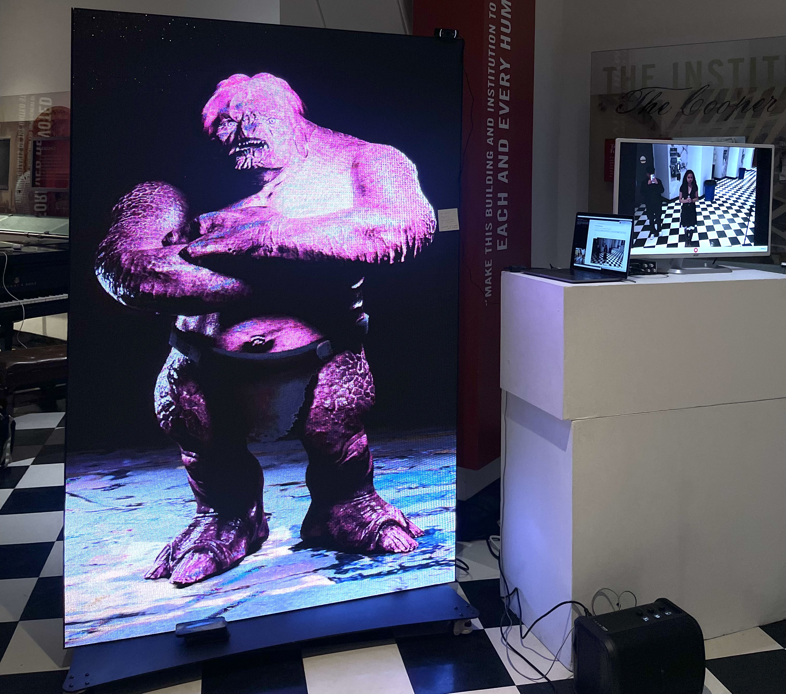

> This directory contains the final project for **Generative Machine Learning (ECE-471)**, an Interactive Multimodal (Audio-Video) Agent that captures live audio and video via the Gemini Live API for real-time speech synthesis.

## Interactive Multimodal Agent (Audio-Video)

Everything required to run *Agnes*—source, configs, and exhibition assets—lives in this folder. Core pieces include the streaming loop (`app.py`), YAML configuration files, a Gradio UI scaffold, the insult-packed system prompt, and poster/screenshot artifacts.

### Objective  
Build an always-on demo that streams webcam frames and mic audio to Gemini 2.0, plays back the model’s synthesized speech, and lets visitors banter with a sarcastic “AI face.” The project highlights low-latency media pipelines, prompt-driven personality control, and a lightweight Gradio front-end—all on commodity hardware.

### Exhibition



**Figure 1**: *Agnes* trolling attendees at the GenML exhibition.

### Approach

Webcam video and audio stream into Gemini’s Live API<sup>[1](#ref1)</sup>; Gemini returns speech that we play back in real time. Gradio wraps the loop in a one-click web UI, while `config.yaml` toggles mic type, model, and voice. On startup we load `instructions.txt`, so *Agnes* begins roasting whoever steps into view.


### Directory Structure

```
.
├── README.md
├── replication.md
├── app.py
├── artifacts
│   ├── agnes_poster.pdf
│   └── exhibition.jpeg
├── config.yaml
├── instructions.txt
├── media.yaml
├── requirements.txt
└── setup.sh
```

- `app.py`  — application entry-point  
- `config.yaml`  — dev-level knobs (mic, model, voice)  
- `media.yaml`  — runtime A/V parameters  
- `instructions.txt`  — system prompt  
- `requirements.txt`  — pinned dependencies  
- `setup.sh`  — environment bootstrapper  

### Results

A fully functioning multimodal agent that insults users in real time with negligible latency.

### On Replication

For a step-by-step local setup guide (env creation, credentials, troubleshooting), see **[replication.md](replication.md)**.


### References

<a name="ref1" href="https://ai.google.dev/gemini-api/docs/live">[1]</a>: Google Gemini Live API documentation – official guide to streaming audio/video into Gemini models.