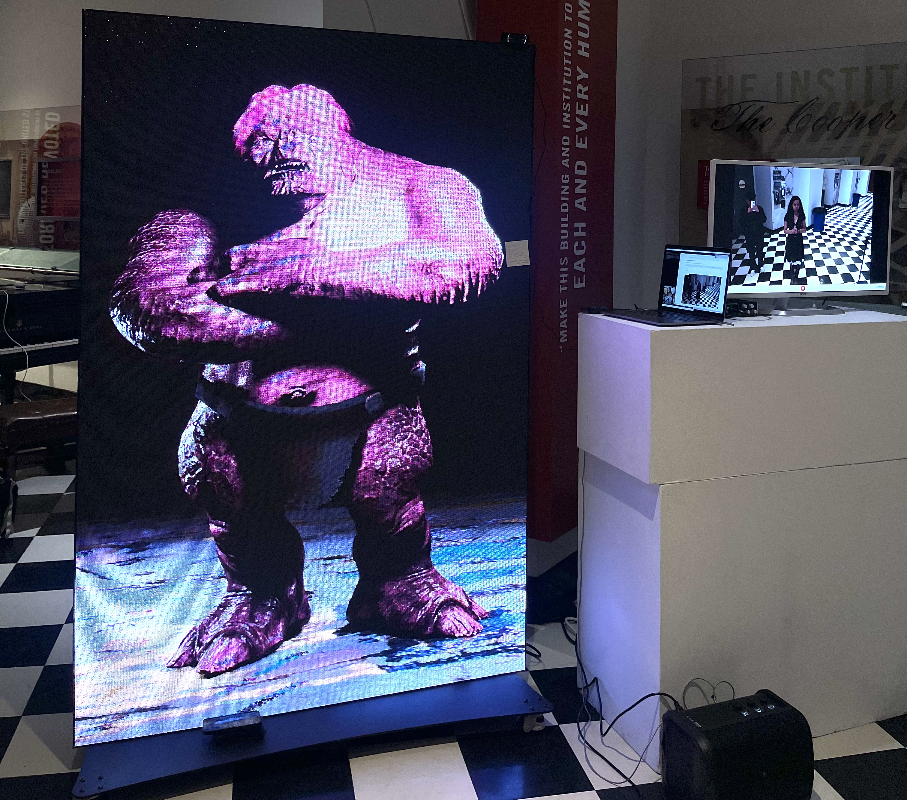
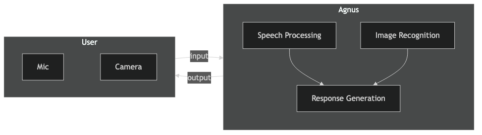
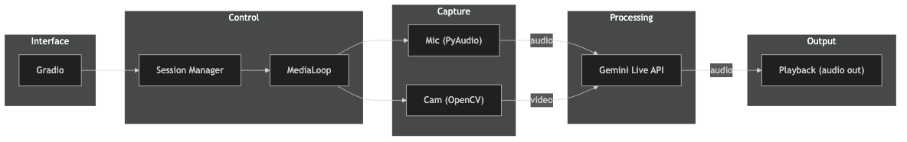

> Final project for **Generative Machine Learning (ECE-471)** at The Cooper Union -- a real-time multimodal agent that captures live audio and video via the Gemini Live API for interactive speech synthesis.

## Agnus -- Real-Time Multimodal Agent

Agnus is an interactive installation where users engage with an AI agent through speech and a live video stream. The system streams webcam frames and microphone audio to Gemini 2.0, plays back synthesized speech in real time, and uses prompt-driven personality control to create a sarcastic, confrontational character. Built with a modular async architecture, YAML-configurable behavior, and a Gradio web interface -- all on commodity hardware.

93 tests | 99% coverage | 4 concurrent async tasks | sub-second response latency

### Exhibition

<p align="center">
  
</p>

<p align="center"><strong>Figure 1</strong>: <em>Agnus</em> exhibited at Cooper Union's Generative ML showcase, Spring 2025.</p>

<br>

### Approach

Webcam video and audio stream into Gemini's Live API<sup>[1](#ref1)</sup>; Gemini returns speech that we play back in real time. Gradio wraps the loop in a one-click web UI, while configs toggle mic type, model, and voice. On startup we load the system instructions, so Agnus begins roasting whoever steps into view.

The codebase organizes functionality into clean modules: utilities handle config and media processing, core modules manage the streaming loop and sessions, and the UI layer presents a simple web interface. Everything is tested with a comprehensive suite (93 tests, 99% coverage) to keep the chaos under control.

<br>

<div align="left" style="margin-bottom: 10px;">

**Legend**

| Label | Description |
|-------|-------------|
| input | audio + video |
| output | audio |

</div>

<div align="center">



<p><strong>Figure 2</strong>: User provides audio and video input to Agnus, which processes speech and images to generate audio responses.</p>

</div>

<br>
<br>

### Getting Started

**1. Clone and navigate:**
```bash
git clone https://github.com/toribiodiego/ECE-471-Generative-Machine-Learning.git
cd ECE-471-Generative-Machine-Learning
```

**2. Set up environment:**
```bash
chmod +x setup.sh
source ./setup.sh
```

This creates a virtual environment, installs dependencies, and generates a `.env` template.

**3. Add credentials:**

Open `.env` and fill in your API key:
```ini
GEMINI_API_KEY=your_gemini_api_key
```

**4. Launch the app:**
```bash
python -m src.app
```

Head to `http://127.0.0.1:7860/` in your browser, click **Start** to begin the live session, and **Stop** to end it.

<br>

**Next Steps:**

For a detailed local setup guide, see [replication.md](replication.md).

For production deployment, see [docs/deployment_guide.md](docs/deployment_guide.md) for comprehensive instructions, performance optimization, and monitoring setup.

If you encounter issues, check [docs/troubleshooting.md](docs/troubleshooting.md) for solutions to common problems.

<br>
<br>

### Architecture

The project follows a modular design that separates concerns, making the codebase maintainable, testable, and extensible. The async design keeps latency low by coordinating four concurrent tasks (audio in/out, video capture, message receiving) without blocking.

<br>

<div align="left" style="margin-bottom: 10px;">

**Legend**

| Component | Technology |
|-----------|------------|
| Interface | Gradio |
| Capture | PyAudio, OpenCV |
| Processing | Gemini Live API |

</div>

<div align="center">



<p><strong>Figure 3</strong>: Data flows from the Gradio interface through session management to capture audio (PyAudio) and video (OpenCV), which are processed by Gemini Live API and returned as audio playback.</p>

</div>

<br>

**Project Structure:**

```
.
├── src/
│   ├── app.py
│   ├── config/
│   │   ├── config.yaml
│   │   ├── media.yaml
│   │   └── instructions.txt
│   ├── core/
│   │   ├── media_loop.py
│   │   └── session_manager.py
│   ├── ui/
│   │   └── gradio_interface.py
│   └── utils/
│       ├── config_loader.py
│       ├── gemini_client.py
│       └── media_processing.py
├── tests/
├── output/
├── artifacts/
├── replication.md
├── requirements.txt
└── setup.sh
```

**Source Code (src/)**
- `app.py` - Launch the application
- `config/` - YAML configs and system prompt to change behavior without touching code (mic type, model selection, voice settings, personality)
- `core/` - Business logic with async streaming loop coordinating four concurrent tasks (audio in/out, video capture, message receiving) and session lifecycle management
- `ui/` - Gradio web interface (presentation layer, isolated from core logic)
- `utils/` - Standalone helpers for config loading, API clients, and media processing (pure functions, easy to test and reuse)

**Testing & Output**
- `tests/` - Comprehensive test suite with 93 tests and 99% coverage across all modules
- `output/` - Runtime-generated logs, recordings, and processing artifacts

**Setup**
- `setup.sh` - Creates virtual environment and installs dependencies
- `replication.md` - Step-by-step local setup guide

For full technical details, system diagrams, and deployment considerations, see [docs/architecture.md](docs/architecture.md).

<br>
<br>

### References

<a name="ref1" href="https://ai.google.dev/gemini-api/docs/live">[1]</a>: Google Gemini Live API documentation -- official guide to streaming audio/video into Gemini models.
